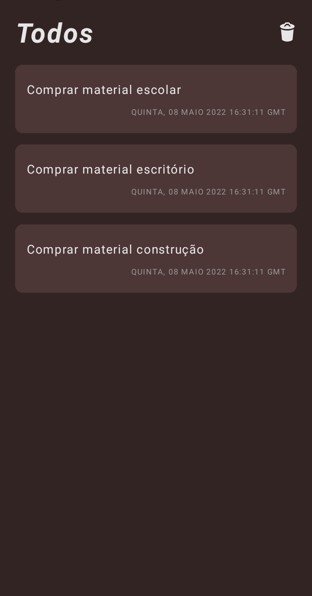
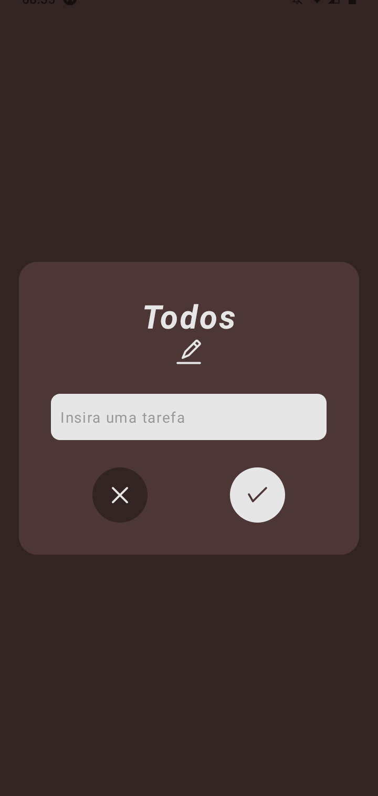
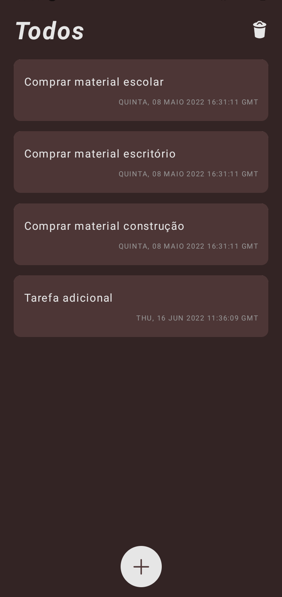
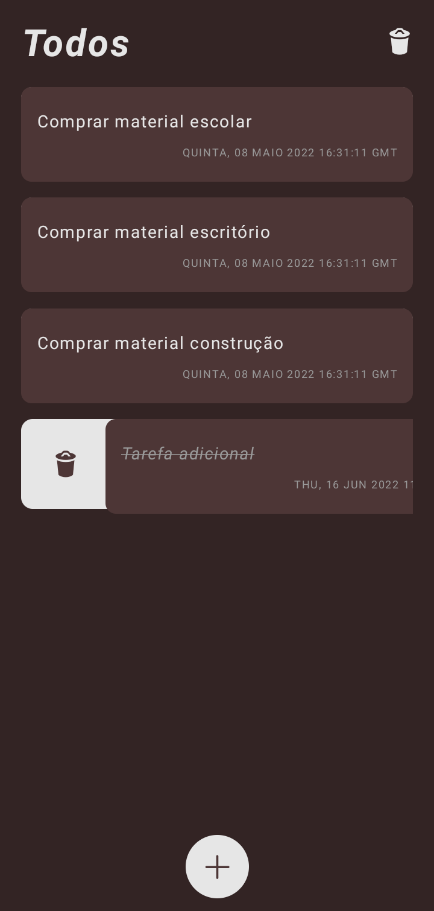

# **ToDo App - Aplicativo de tarefas**

Desenvolvimento de um pequeno aplicativo, usando expo, para inserção e exclusão de tarefas do usuário. 

A aplicação consiste, basicamente, em uma tela principal na qual o usuário poderá visualizar todas as suas tarefas pendentes em ordem cronológica de inserção, podendo excluir de forma individual cada uma deletar todas de uma única vez. Além disso, uma nova página foi criada para que pudesse ser inserida uma nova tarefa, ao conjunto, ou editar alguma já existente.

## **O que aprendeu-se ao desenvolver essa simples aplicação:**

- Conceitos de componetização dos elementos da aplicação; ✅
- Estilização por meio da lib styled-components; ✅
- Criação de rotas para navegação entre as páginas da aplicação usando CreateStackNavigation; ✅
- Criação de modais para a aplicação; ✅
- Usando ícones do expo por meio da lib expo vector-icons; ✅

## **Observações importantes:**

- Todo o projeto foi desenvolvido no expo;

## **Imagens da aplicação desenvolvida:**
 
<h1 align="center">
  
  
  
    
    
</h1>

